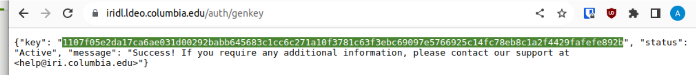

# Configuring PyCPT for authenticated download of private data

Most of the datasets in the IRI Data Library can be downloaded without logging in, but there are also private datasets that are available only to authorized users.
If you are authorized to use a private dataset, you can configure PyCPT to download private data on your behalf as follows.

1. In a text editor, create a file in your home directory called `cookies.txt` and copy-paste the following line into it:
    ```
    iridl.ldeo.columbia.edu	FALSE	/	TRUE	0	__dlauth_id	xxxxx
    ```
1. Visit https://iridl.ldeo.columbia.edu/auth/genkey in a browser. After logging in to the Data Library, you will see a page like this:

    

1. Copy the API key from that page (the highlighted string in the screenshot), and paste it into `cookies.txt` in place of `xxxxx`.
1. In a text editor, create a file in your home directory called `.daprc` (note the dot at the beginning) with the following contents:
    ```
    HTTP.COOKIEJAR=/home/myuser/cookies.txt
    ```
    substituting your user name for `myuser`.

 Save the files and close your text editor. PyCPT will now use your API key to download private data.

 Note that each time you visit `https://iridl.ldeo.columbia.edu/auth/genkey`, a new key will be generated and the previous one will be invalidated. Any scripts that use an invalidated key will have to be updated with the new key.
